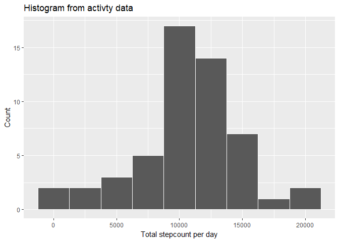
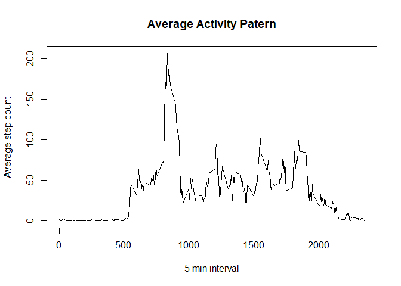
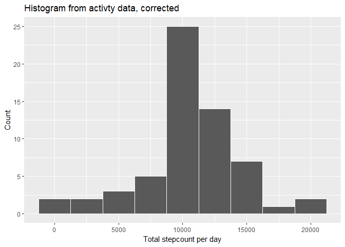
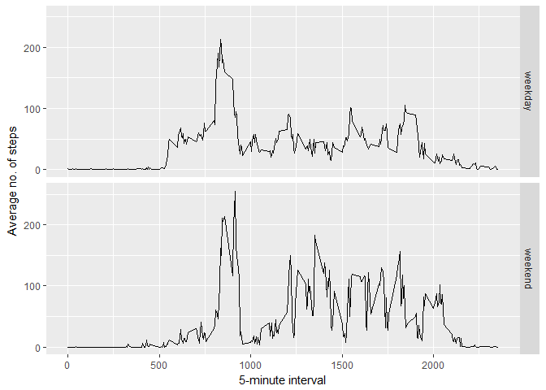

## Loading and preprocessing the data


```r
rawdata <- read.csv("data\\activity.csv")
data <- rawdata[!is.na(rawdata$steps),]
```


## What is mean total number of steps taken per day?

```r
stepCountDay <- aggregate(steps~date, data, sum)

library(ggplot2)

qplot(stepCountDay$steps,
      geom="histogram",
      binwidth = 2500,
      main = "Histogram from activty data",
      xlab = "Total stepcount per day",
      ylab = "Count",
      col = I("white")
      )
```

<!-- -->

```r
meanSteps <- mean(stepCountDay$steps)
medianSteps <- median(stepCountDay$steps)
```

The mean of the steps taken each day is: 1.0766189\times 10^{4}.
And the median: 10765.


## What is the average daily activity pattern?

```r
stepAvgInt <- aggregate(steps~interval, data, mean)
plot(stepAvgInt,
     type = "l",
     main = "Average Activity Patern",
     xlab = "5 min interval",
     ylab = "Average step count")
```

<!-- -->

```r
maxInt <- stepAvgInt[which.max(stepAvgInt$steps),]
```
The interval with the highest average number of steps is 835, 
with 206.1698113 steps on average.


## Imputing missing values
The number of missing values is equal to:

```r
nrow(rawdata) - nrow(data)
```

```
## [1] 2304
```

To fill in those gaps, the average activity pattern is used. This pattern was 
calculated from the filtered data. For each row where the number of steps is 
unknown, the daily average for that interval is inserted.


```r
fulldata <- rawdata
for (i in 1:nrow(fulldata)) {
  if (is.na(fulldata[i, 1])) {
    fulldata[i,1] <- stepAvgInt[stepAvgInt$interval == fulldata[i, 3],2]
  }
}
```

Then to create a histogram and calculate the mean and median:

```r
stepCountDayC <- aggregate(steps~date, fulldata, sum)
qplot(stepCountDayC$steps,
      geom="histogram",
      binwidth = 2500,
      main = "Histogram from activty data, corrected",
      xlab = "Total stepcount per day",
      ylab = "Count",
      col = I("white")
      )
```

<!-- -->

```r
meanStepsC <- mean(stepCountDayC$steps)
medianStepsC <- median(stepCountDayC$steps)
```

The new mean of the steps taken each day is: 1.0766189\times 10^{4}.
And the new median: 1.0766189\times 10^{4}.

To find the impact we compare the old mean (1.0766189\times 10^{4}) and median (10765) 
to the new values. This shows that because we took the averages of an already 
cleaned dataset to fill in NA values, the mean has not changed. The median 
however has increased.


## Are there differences in activity patterns between weekdays and weekends?

```r
fulldata$wdType <- ifelse(as.POSIXlt(fulldata$date, origin = "1970-01-01")$wday %in% c(6, 7), "weekend", "weekday" )
stepAvgIntDaytype <- aggregate(steps~interval+wdType, fulldata, mean)

ggplot(stepAvgIntDaytype, 
       aes(x=interval, y=steps)) + 
  geom_line() + 
  facet_grid(wdType~.) +
  ylab("Average no. of steps") +
  xlab("5-minute interval")
```

<!-- -->
